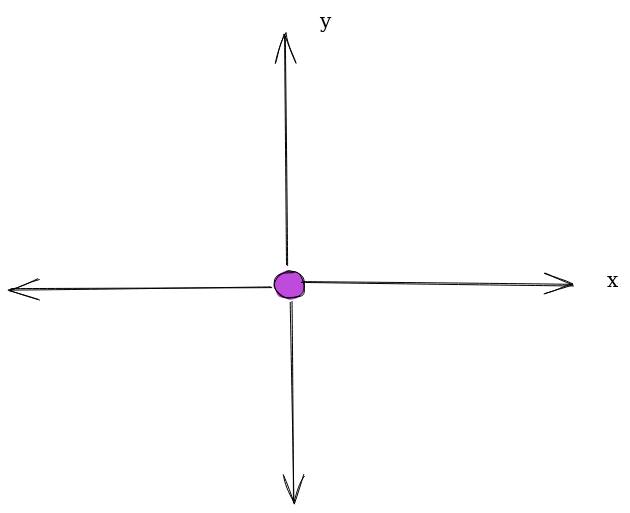

# Mecanum Drive (Part 2)

:::note Resources
* [Mecanum Drive (Part 1)](https://ftc-tech-toolbox.vercel.app/docs/Commonly%20Programmed%20Modules/Mec) 
* [Localization](https://ftc-tech-toolbox.vercel.app/docs/category/localization--odometry)
* [PID Control](https://ftc-tech-toolbox.vercel.app/docs/Control%20Theory/pid)
* [Gluten Free's Move to Position Tutorial](https://www.youtube.com/watch?v=3l7ZNJ21wMo) - Alternative method which doesn't make use of PID.
* [CTL-ALT-FTC's Mecanum Controller](https://www.ctrlaltftc.com/practical-examples/drivetrain-control#mecanum-drivetrain-controller) - Another high-quality tutorial.
:::

We will now be creating a far more accurate movement system for our mecanum robot, which if done correctly, should look something like this: 

<iframe width="100%" height="422" src="https://www.youtube.com/embed/42KxhA5kUL0" title="Control Award State Submission" frameborder="0" allow="accelerometer; autoplay; clipboard-write; encrypted-media; gyroscope; picture-in-picture; web-share" allowfullscreen></iframe>

In the first part of our discussion (Mecanum Drive Part 1), we explored the development of a simple autonomous program utilizing a mecanum drive train by leveraging encoders and timers. While this algorithm serves its purpose, it suffers from several limitations that require improvement. One notable drawback is the absence of localization, which means that if our robot collides with another robot, the autonomous program would fail to follow the intended path. Furthermore, the previous algorithm solely relies on a velocity PID and timer to reach a target position, leading to inconsistency in the robot's final location due to fluctuations in the PID's behavior.

To address these shortcomings and enhance the performance of our autonomous program, we can consider the following improvements:

* Implement Localization: By incorporating localization techniques such as odometry or using sensors like cameras or lidar, we can accurately determine the robot's position and orientation in the environment. This information enables the robot to navigate around obstacles and maintain a desired path even in the presence of collisions with other robots.
* Traverse the Field Using Coordinate Points, Not Speeds: In our previous algorithm, we fed speeds into our driveFieldCentricFunction to travel to a point of the field. However, it can be very difficult to manually tune the speed and timers. Now that we have localization we can create a new function where we simply input the desired coordinate, and the robot will travel to that point. This will allow you to create a far more accurate autonomous program in a fraction of the time.  
* Implement a Positional Feedback Controller: Instead of relying on a standalone velocity PID controller and timer, we can switch to a PID controller which relies on our odometry localization for feedback. This ensures that our control system relies solely on our localization system. Given that your localization system is accurate, this results in improved accuracy and consistency in the final position of the robot.
  * Using a velocity PID would create inconsistencies as it may take either a longer or shorter time for your motors to achieve a certain speed depending on the robot's battery level.
  * By continuously analyzing the error between the goal point and the robot's current position we can power the robot's motors in such a way that it is driven toward the destination point.

We would go about implementing an algorithm like the one described above by creating a moveToPosition function where the user inputs a coordinate point that the robot must travel to, along with the angle the robot must turn at. In this case, we imagine the field to be a grid with the robot's starting point as its origin. 



The robot then continuously checks how far away its current position is, measured by odometry, in both the x and y directions. We then feed these distances into two separate PID controllers, one of which controls the movement of the robot in the x direction and the other in the y direction. The output of these PID controllers are the powers at which the robot must move in the x direction and y direction. We feed these outputted powers into the `driveFieldCentric()` function, allowing the robot to move in the correct direction regardless of its orientation. 

To terminate the PID loop the robot will either reach a manually set threshold distance to the destination point (since a PID will almost always have a small amount of error) or cross a specified timeout point before stopping. 

:::info
Note that a similar process is performed on the angle if you need to control the angular orientation of the robot. Our code will demonstrate this. 
::: 

## Implementation

### Step 1: Localization

In this step, we will be making use of the three deadwheel odometry localization class from the localization module: 
```java 
public class Odometry {
  // Constants
  public final double ENCODER_WHEEL_DIAMETER = 2; // Diameter of your deadwheel
  private final double ENCODER_TICKS_PER_REVOLUTION = 1120; // Number of ticks for a revolution of the deadwheel
  private final double ENCODER_WHEEL_CIRCUMFERENCE = Math.PI * 2.0 * (ENCODER_WHEEL_DIAMETER * 0.5);
  private final double ENCODER_WIDTH = 12.0; // Distance between parallel deadwheels

  // Variables
  private double xPos, yPos, angle;
  private double lastLeftEnc, lastRightEnc, lastNormalEnc;

  public Odometry(double xPos, double yPos, double angle) {
    this.xPos = xPos;
    this.yPos = yPos;
    this.angle = angle;
  }

  public Odometry(double angle) {
    this.xPos = 0;
    this.yPos = 0;
    this.angle = angle;
  }

  public Odometry() {
    this(0);
  }

  // https://github.com/Beta8397/virtual_robot/blob/master/TeamCode/src/org/firstinspires/ftc/teamcode/EncBot.java
  public void updatePosition(double l, double r, double n, double ang) {
    double dR = r - lastRightEnc;
    double dL = l - lastLeftEnc;
    double dN = n - lastNormalEnc;

    double rightDist = dR * ENCODER_WHEEL_CIRCUMFERENCE / ENCODER_TICKS_PER_REVOLUTION;
    double leftDist = -dL * ENCODER_WHEEL_CIRCUMFERENCE / ENCODER_TICKS_PER_REVOLUTION;
    double dyR = 0.5 * (rightDist + leftDist);
    double headingChangeRadians = (rightDist - leftDist) / ENCODER_WIDTH;
    double dxR = -dN * ENCODER_WHEEL_CIRCUMFERENCE / ENCODER_TICKS_PER_REVOLUTION;
    double avgHeadingRadians = Math.toRadians(angle) + headingChangeRadians / 2.0;
    double cos = Math.cos(avgHeadingRadians);
    double sin = Math.sin(avgHeadingRadians);

    xPos += dxR * sin + dyR * cos;
    yPos += -dxR * cos + dyR * sin;
    angle = normalizeAngle(ang);
    lastNormalEnc = n;
    lastLeftEnc = l;
    lastRightEnc = r;
  }

  public double normalizeAngle(double rawAngle) {
    double scaledAngle = rawAngle % 360;
    if (scaledAngle < 0) {
      scaledAngle += 360;
    }

    if (scaledAngle > 180) {
      scaledAngle -= 360;
    }

    return scaledAngle;
  }

  public String displayPositions() {
    return outStr;
  }

  public double getAngle() {
    return angle;
  }

  public double getX() {
    return xPos;
  }

  public double getY() {
    return yPos;
  }

  public void resetOdometry() {
    resetOdometry(0, 0, 0);
  }

  public void resetOdometry(Point p) {
    resetOdometry(p.xP, p.yP, p.ang);
  }

  public void resetOdometry(double xPos, double yPos, double angle) {
    this.xPos = xPos;
    this.yPos = yPos;
    this.angle = angle;
  }

  public void setAngle(double angle) {
    this.angle = angle;
  }

  private String format(double num) {
    return String.format("%.3f", num);
  }
}
```


## Step 2: Movement Code
As mentioned above, with the returned odometry position of the robot as the feedback for our movement controller, we will be making use of three PID controllers, each of which controls a separate aspect of the robot's movement (in the x-direction, y-direction, turning). We will then feed in the output of the PID controllers (speeds at which the robot must drive, turn, and strafe) into the `driveFieldCentric` function which converts the directional powers into motor powers. 

Some important notes regarding the code: 
* Note that this code is inside a while-loop. This means that if you are using manual mode with your hubs, you must clear the bulk caching mode of all hubs in the loop.
* The robot will keep trying to drive to the listed position until one of two conditions is achieved:
  * The returned odometry position is close enough to the target position (recommended to be 1 to 2 inches)
  * The loop has exceeded its time limit (this should only be triggered if there is something obstructing the robot's path)
* Assume the odometry class has already been initialized, this code will just cover the while loop.
* Assume odometry starts at point (0,0,0)
* MOE means margin of error

```java 
public void moveToPosition(double targetX, double targetY, double targetAngle, double MOE, double angleMOE, double maxTime){
     ElapsedTime timer = new ElapsedTime();
     double xError = 200, yError = 200, angleError = 200; //Set arbitrary values that are larger than the MOE
     double previousTime = 0;
     while(timer.milliseconds() <= maxTime && (Math.abs(xError) >= MOE || Math.abs(yError) >= MOE || Math.abs(angleError) >= angleMOE){
         odometry.updatePosition();
         for (LynxModule hub : allHubs) {
            hub.clearBulkCache();
         }
         
         double k_P = 0.05; //Tune this coefficient
         double currentTime = timer.milliseconds();
         
         double xError = targetX - odometry.getX();
         double yError = targetY - odometry.getY();
         double angleError = targetAngle - odometry.getAngle();
         
         double xP = k_P * xError;
         double yP = k_P * yError;
         double thetaP = k_P * angleError;
         
         double xD = calculateD(xError, previousX, currentTime, previousTime);
         double yD = calculateD(yError, previousY, currentTime, previousTime);
         double thetaD = calculateD(angleError, previousTheta, currentTime, previousTime);
         
         double xPow = xP + xD;
         double yPow = yP + yD;
         double anglePow = thetaP + thetaD;
         
         //driveFieldCentric(drive, strafe, turn);
         driveFieldCentric(yPow, xPow, anglePow);
         //experiment to see if y is your drive or strafe
         
         previousX = xError;
         previousY = yError;
         previousTheta = angleError;
         previousTime = currentTime;
     
 } 
 
 public double calculateD(double curr_error, double prev_error, double curr_time, double prev_time){

     double k_d = 0.05; //Tune this coefficient
     double error_diff = curr_error - prev_error;
     double time_diff = curr_time - prev_time;
     
     double errorByTime = error_diff / time_diff;
     double d = k_d * errorByTime;
     
     return d;
 }
```
If you don't recall why we need to clear the Bulk Cache of the LynxModules in the loop, review it in the Lynx Module section. 

### Explanation
This code segment is essentially using 3 different PIDS to drive movement of the robot, one on the X axis, one on the Y axis, and one for the angle of the robot. The while loop ensures that all PIDS will run until they are within their desired margin of error to that position. If you noticed, we did not use an integral coefficient in this code, we believe that the integral coefficient is not required in FTC programming in this case, so we recommend only using the P and D coefficients.

Since we need a current Error for all three PIDs, we use `xError`, `yError`, and `angleError` to store the three current errors. Then at the end of the loop, we store them in `previousX`, `previousY`, and `previousTheta`. Notice even though we have 3 PIDs, we only need to use one timer for the time.

In an attempt to simplify things within the loop, to calculate the d coefficient's power, we created a function, `calculateD`, that is called in the main while loop.
