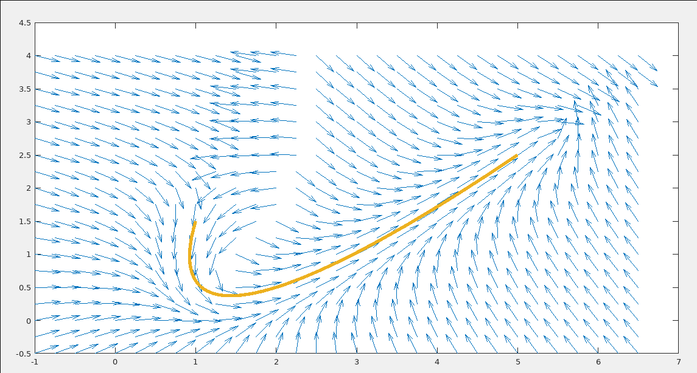

# Guided Vector Fields

:::caution
Guided vector fields are an advanced topic and can be pretty tricky to implement. Therefore, if you are looking to integrate GVFs into your codebase, we highly recommend that you make use of the [RoadRunner](https://learnroadrunner.com/)  library since they make use of GVFs. Because their library is so well documented and tested it will likely save you a lot of time and effort to use their high-quality code.
:::

Guided Vector Fields (GVFs) are a concept within the field of robotics that involves using vector fields to assist in motion planning, control, and navigation of robotic systems. This approach leverages mathematical representations to guide the movement of robots in complex environments, enabling them to efficiently navigate, avoid obstacles, and achieve desired tasks.

At its core, a vector field is a mathematical construct that assigns a vector to each point in space. In the context of robotics, a vector field defines the direction and magnitude of movement that a robot should follow at any given location. Guided Vector Fields take this concept further by incorporating additional information to guide the robot's behavior. This information can come from various sources, such as sensor data, predefined maps, or desired trajectories.

If the above explanation was too complicated, here is a more intuitive explanation: 

Imagine your robot wants to follow some arbitrary path. Guided Vector Fields are like invisible pathways that are present at every point on the field that push the robot toward the desired path.

Think of these pathways as arrows spread out across the space where the robot is moving. Each arrow points in a certain direction, showing the robot which way to move. But these pathways are smart – they can change based on what's happening around the robot.

For example, if the robot gets too close to a wall or an obstacle, these pathway arrows push the robot away so it doesn't hit anything. If the robot has a specific place to reach, these arrows help it find the best and smoothest way to get there, avoiding any obstacles in the way.

## GVF Calculation



Take a look at the above image. This is an example of a GVF that was generated for the following path. The arrows are the generated vectors that "push" the robot along the path. If you try following the arrows at any starting point you will see that it takes you through the path. It can be helpful to **imagine the graph as a river and the vectors as currents that take the robot through the river.**

How do we actually calculate the vectors for every possible point the robot could be on? 

Firstly we need to imagine the field as a coordinate plane, with each (x,y) coordinate representing a possible location for the robot in inches. Since we already know the total dimensions of the field, we know that our algorithm only needs to generate 20736 vectors since the FTC field dimensions are 12 x 12 feet or 144 x 144 inches. 

Then we have to establish some rules for the path our robot must follow (for reasons which should become clear later): 

* It must be represented by some equation
* The equation must be differentiable (we should be able to find the rate of change at every point)

For creating a path that meets these requirements, using Cubic Bezier Splines is a great choice. These splines are crafted by setting 4 control points. Then, a unique equation comes into play, crafting a seamless path that stays within those control points.

<iframe width="100%" height="422" src="https://www.youtube.com/embed/pnYccz1Ha34" title="Bezier Curves Explained" frameborder="0" allow="accelerometer; autoplay; clipboard-write; encrypted-media; gyroscope; picture-in-picture; web-share" allowfullscreen></iframe>

The following code shows a sample C++ implementation from Geeks for Geeks. It should be straightforward to implement this in Java. 
```c++
/* Function that take input as Control Point x_coordinates and
Control Point y_coordinates and draw bezier curve */

// Link https://www.geeksforgeeks.org/cubic-bezier-curve-implementation-in-c/ 
vector<pair<int,int>> points; 
void bezierCurve(int x[] , int y[])
{
    double xu = 0.0 , yu = 0.0 , u = 0.0 ;
    int i = 0 ;
    for(u = 0.0 ; u <= 1.0 ; u += 0.0001)
    {
        xu = pow(1-u,3)*x[0]+3*u*pow(1-u,2)*x[1]+3*pow(u,2)*(1-u)*x[2]
             +pow(u,3)*x[3];
        yu = pow(1-u,3)*y[0]+3*u*pow(1-u,2)*y[1]+3*pow(u,2)*(1-u)*y[2]
            +pow(u,3)*y[3];
        // (xu, yu) is a coordinate point
        points.push_back({xu,yu}); 
    }
}
```

Now that we have our path, the next step is to create the vectors that the robot can follow. However, for efficiency purposes, we will not be generating the vector values for every possible coordinate. Instead, we only be calculating the vector for the coordinate point the robot is currently on. 

To actually calculate the vector for some coordinate point we need to find the point on the curve that is closest to the robot's current position. We can do this by scanning through the list of coordinates that the curve contains. 

Once we do that we need to find how to push the robot in the direction of the point. 

To do this we use the derivative (rate of change) of the selected point and translate it by the robot's current position to create a movement vector, a list of values that tell the robot at what power it must move in the x and y directions. To convert the vector into motor powers we feed the x and y component of the vector into a field-centric driving function. 

[Because bezier splines are calculated using a standard formula we can calculate its derivative by hand using some calculus. 
](https://stackoverflow.com/questions/4089443/find-the-tangent-of-a-point-on-a-cubic-bezier-curve)

For a more in-depth explanation of the math behind GVFs please refer to the following paper: https://ieeexplore.ieee.org/document/7942030

## Implementation
The following repositories contain implementations of path following via GVFs. However, each code base implements the algorithm differently:

This repository makes use of cubic bezier splines **(recommended)**

**This code visualizes the vector field rather than plugging the values into motors. To make this code useable in FTC you will need to plug the movement vector values into a field-centric driving function, which can be found in our mecanum modules.**

https://github.com/FTC-9974-THOR/GuidedVectorField

This repository creates paths by manually entering the coefficients of the spline equation meaning it is not intuitive to use, however, you can easily adapt this code such that it automatically generates the coefficients of a cubic bezier spline. 

https://github.com/jw5243/MPC-Lib/blob/master/MPCLib/src/main/java/com/horse/mpclib/examples/RobotGVF.java

This repository provides a GVF implementation in the form of a library, although it is written in Kotlin experienced programmers should be able to convert the code into Java with a little effort.
https://github.com/AsianKoala/koawalib

This repository is written in Python however it is a great tool to visualize GVFs.
https://github.com/AsianKoala/gvf

Written with ROS not FTC SDK:
https://github.com/adrianomcr/vectorfield_stack/tree/main/distancefield/scripts/distancefield
