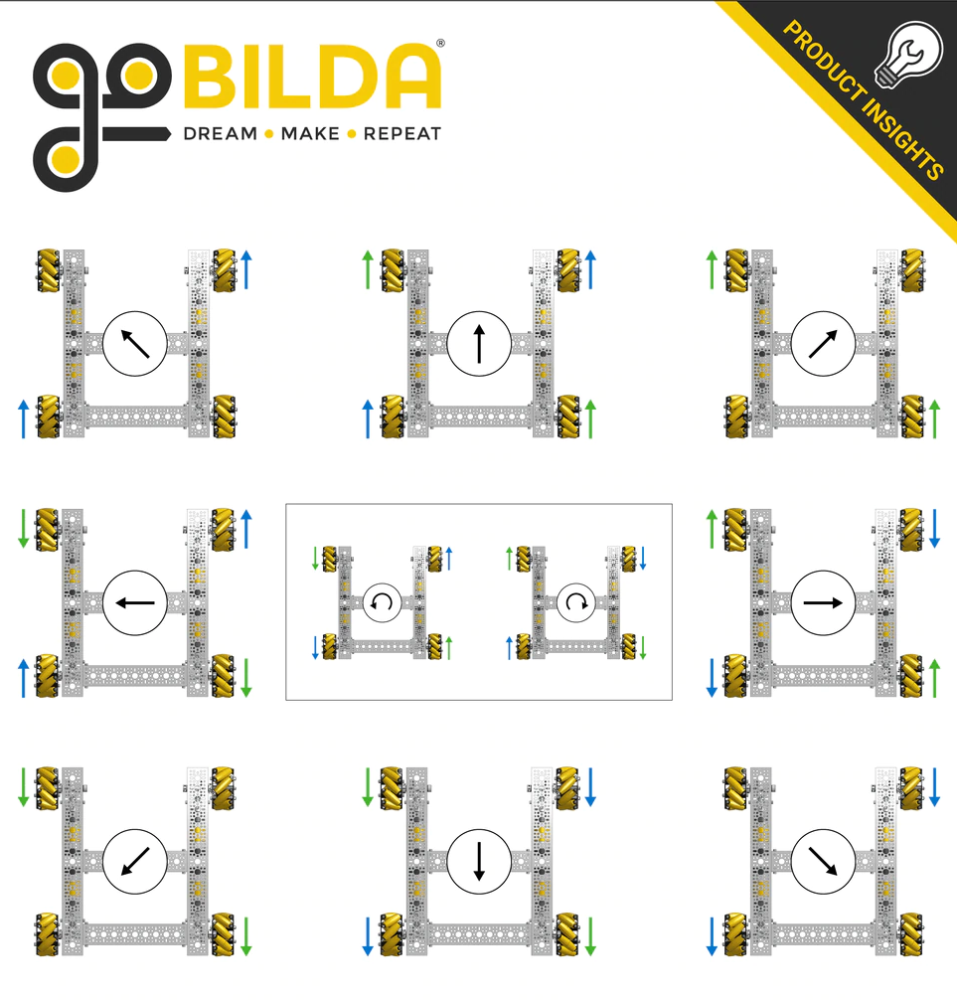

# Mecanum Drive (Part 1)
:::note Resources

* [GM0's Mecanum Drive Tutorial](https://gm0.org/en/latest/docs/software/tutorials/mecanum-drive.html) - Detailed tutorial containing explanations about the math and logic behind mecanum drive control along code implementations. **Must read before proceeding!**
* [FTC Team 7477's Mecanum Drive Video](https://www.youtube.com/watch?v=SdcV15RQxkQ) - Supplemental resource explaining how a mecanum drive train would appear on a physical robot.
* [FTC Team 9794's Mecanum Block Programming Video](https://www.youtube.com/watch?v=cXrDz1cb8N0) - For block code users.

:::

## What is Mecanum?
A mecanum drive system makes use of a special type of wheel known as mecanum wheels which allow robots to move not only forward and backward, but sideways as well. Here is a quick demo of the capabilities of mecanum:
<iframe width="100%" height="422" src="https://www.youtube.com/embed/noqBUEgyQ8A" title="The Brilliant Engineering of Mecanum Wheels!" frameborder="0" allow="accelerometer; autoplay; clipboard-write; encrypted-media; gyroscope; picture-in-picture; web-share" allowfullscreen></iframe>
Mecanum drive systems allow teams to move efficiently during both the autonomous and driver-controlled periods due to the added directions of movement that are not present in tank drive trains. Moreover, due to its ease of construction mecanum drive trains over other options (ie differential swerve), mecanum is the most used drive variation in FTC robotics. 
## How It Works
The mecanum drive train consists of two sets of wheels, two right wheels, and two left wheels, depending on the direction the rollers are facing. The rollers are angled at 45°. The force vectors created by the wheel arrangement propel the drive train in different directions.



This picture is a very good reference to show how the different combinations of power set to the wheels change the direction the drive train will go. 

## TeleOp Implementation (Robot Centric)
The concept of the mecanum drive implementation relates to the tank drive train implementation. However, in this case, you need three components. Those are drive, turn, and strafe. As you've probably realized the only difference in programming the mecanum drive and tank drive is the strafe component.
We are using the left joystick y-axis for the drive, the right joystick x-axis for the turn, and the left joystick x-axis for the strafe. Assume frontLeft, frontRight, backLeft, and backRight are the initialized drive motors.
```java 
double drive;
double turn;
double strafe;
double fLeftPow, fRightPow, bLeftPow, bRightPow;

// Reverse the right side motors
// Reverse left motors if you are using NeveRests
frontRight.setDirection(DcMotor.Direction.REVERSE);
backRight.setDirection(DcMotor.Direction.REVERSE);

drive = gamepad1.left_stick_y * -1; 
turn = gamepad1.right_stick_x;
strafe = gamepad1.left_stick_x;

fLeftPow = Range.clip(drive + turn + strafe, -1, 1);
bLeftPow = Range.clip(drive + turn - strafe, -1, 1);
fRightPow = Range.clip(drive - turn - strafe, -1, 1);
bRightPow = Range.clip(drive - turn + strafe, -1, 1);

frontLeft.setPower(fLeftPow);
backLeft.setPower(bLeftPow);
frontRight.setPower(fRightPow);
backRight.setPower(bRightPow); 

```
As you can see, the drive and turn components are the same as the tank drive. However, due to the fact that strafing needs wheels on the same side to be spinning in opposite directions, each wheel will need its own power. 
:::info
Oftentimes, teams will have a problem where everything seems right in the code but the robot is not moving as expected. If this occurs, the orientation of the mecanum wheels may be incorrect. The rollers should form an "X" shape from the top of the robot.
:::

## Creating a Field-Centric-Based Autonomous Program

:::caution
The following code uses field-centric drive code to control the mecanum wheels, not the robot-centric code used above. To gain a solid understanding of field-centric driving please refer to the GM0 link in the resources tab of this module. 
:::
:::danger
The following code is provided to showcase a simple method of autonomously controlling a mecanum drive system without cluttering the code with odometry functions. **For a more accurate and sophisticated mecanum control system, please refer to the mecanum modules in the autonomous driving section.**
:::

### Demo Video of the Code Used

<iframe width="100%" height="422" src="https://www.youtube.com/embed/s5djL5tj8js" title="Meet 3 Match 4" frameborder="0" allow="accelerometer; autoplay; clipboard-write; encrypted-media; gyroscope; picture-in-picture; web-share" allowfullscreen></iframe>

The logic behind this code is fairly simple, we make use of field-centric driving to make the robot drive forward or sideways for some number of seconds. Making use of encoders should make this movement fairly accurate as a velocity PID will be automatically enabled. However please note that **later modules will provide code that is far superior to the following implementation!**
We also use a heavily simplified version of a PID controller to enable the robot to turn to a desired angle while moving, making use of the IMU to do this. 
### Code
:::info
Note that in the following line: `double turn = Range.clip(angleDiff * 0.01, -1, 1);` we set the power that the robot should turn at to reach the angle desired.  You can modify this speed as needed by changing the constant 0.01 as needed, increasing it to increase the turn speed, and decreasing it to slow the robot down. 
:::
#### Robot Class
```java 
public class Robot {

   Motor fLeftMotor, bLeftMotor, fRightMotor, bRightMotor;
   BNO055IMU gyro;
   List<LynxModule> allHubs;

  public Robot() {
    // Configuring Hubs
    allHubs = hardwareMap.getAll(LynxModule.class);
    for (LynxModule hub : allHubs) {
      hub.setBulkCachingMode(LynxModule.BulkCachingMode.AUTO);
    }
    
    // We recommend that you make use of encoders if using this method!
    Motor fLeftMotor = new Motor(hardwareMap, "front_left_motor");
    Motor bLeftMotor = new Motor(hardwareMap, "back_left_motor");
    Motor fRightMotor = new Motor(hardwareMap, "front_right_motor");
    Motor bRightMotor = new Motor(hardwareMap, "back_right_motor");
    
    // Reverse the right side motors
    // Reverse left motors if you are using NeveRests
    fRightMotor.setDirection(DcMotorSimple.Direction.REVERSE);
    bRightMotor.setDirection(DcMotorSimple.Direction.REVERSE);
    
    this.fLeftMotor = fLeftMotor;
    this.fRightMotor = fRightMotor;
    this.bLeftMotor = bLeftMotor;
    this.bRightMotor = bRightMotor;
    this.gyro = gyro;
    this.opMode = m;
    this.allHubs = allHubs;
  }

  // Use the IMU to return the angle of the robot. 
  public double getAngle() {
    Orientation angles =
        gyro.getAngularOrientation(
            AxesReference.INTRINSIC, AxesOrder.ZYX, AngleUnit.DEGREES); // ZYX is Original
    return angles.firstAngle;
  }
  
  // Remaps the given angle into the range (-180, 180].
  public static double normalize(double degrees) {
    double normalized_angle = Angle.normalizePositive(degrees);
    if (normalized_angle > 180) {
      normalized_angle -= 360;
    }
    return normalized_angle;
  }

  // Drive or Strafe to at some power while turning to some angle.  
  public void driveFieldCentric(double drive, double angle, double strafe) {
    // https://gm0.org/en/latest/docs/software/tutorials/mecanum-drive.html#field-centric
    double fRightPow, bRightPow, fLeftPow, bLeftPow;
    double botHeading = -Math.toRadians(gyro.getAngularOrientation().firstAngle);
    
    // Compute how much you need to turn to maintain that angle
    currAngle = getAngle();
    double angleDiff = normalize(currAngle - angle);
    double turn = Range.clip(angleDiff * 0.01, -1, 1); // multiply by some constant 
    // so the robot turns smoothly
  

    double rotX = drive * Math.cos(botHeading) - strafe * Math.sin(botHeading);
    double rotY = drive * Math.sin(botHeading) + strafe * Math.cos(botHeading);
    
    // Do the math found in GM0
    double denominator = Math.max(Math.abs(strafe) + Math.abs(drive) + Math.abs(turn), 1);
    fLeftPow = (rotY + rotX + turn) / denominator;
    bLeftPow = (rotY - rotX + turn) / denominator;
    fRightPow = (rotY - rotX - turn) / denominator;
    bRightPow = (rotY + rotX - turn) / denominator;

    setDrivePowers(bLeftPow, fLeftPow, bRightPow, fRightPow);
  }

  public void setDrivePowers(double bLeftPow, double fLeftPow, double bRightPow, double fRightPow) {
    bLeftMotor.setPower(bLeftPow);
    fLeftMotor.setPower(fLeftPow);
    bRightMotor.setPower(bRightPow);
    fRightMotor.setPower(fRightPow);
  }

  public void stopDrive() {
    setDrivePowers(0, 0, 0, 0);
  }
 
  // Misc. Functions / Overloaded Method Storage
  private double getVoltage() {
    double voltage = Double.MIN_VALUE;
    for (LynxModule hub : allHubs) {
      voltage = Math.max(voltage, hub.getInputVoltage(VoltageUnit.VOLTS));
    }

    return voltage;
  }

  @Override
  public void runOpMode() throws InterruptedException {}
}
```

#### Opmode
```java 
import com.qualcomm.robotcore.util.ElapsedTime;

@Autonomous(name = "Sample", group = "Robot")
public class BluePrimary extends Robot {
  @Override
  public void runOpMode() throws InterruptedException {
    sleep(500);
    telemetry.addData("Status", "Initialized");
    telemetry.update();

    waitForStart();

    timer.reset(); // allows you to keep track of how long the robot has been driving
    while (timer.milliseconds() <= 500){
    // drive backwards at 15% power at an angle of 0 degrees for 500 milliseconds
      driveFieldCentric(-0.15, 0, 0);
    }
    
    stopDrive(); // always stop the drive train after a movement! 

    timer.reset(); // always reset the timer before starting another movement!
    while (timer.milliseconds() <= 1200) {
    // move right at 30% power at an angle of 10 degrees 
      dt.driveFieldCentric(0, 10, 0.3);
    }
    
  }
}
```
