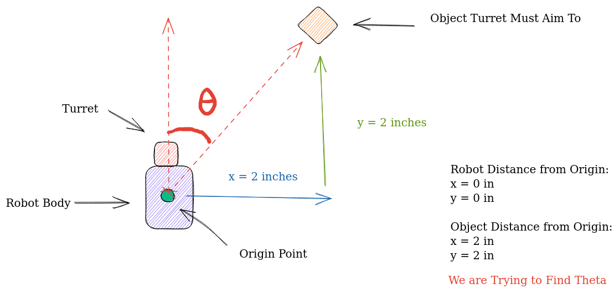
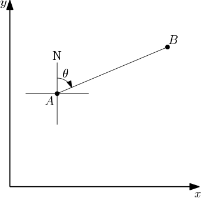
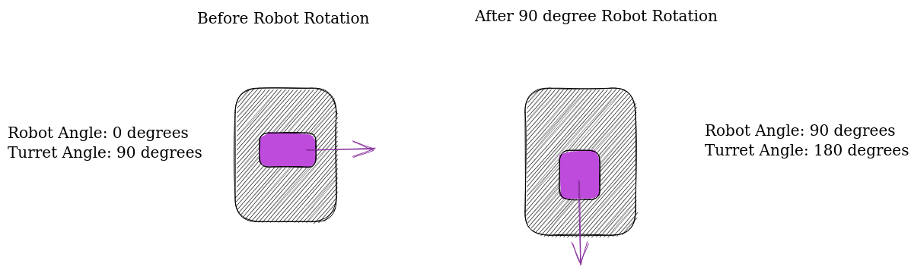
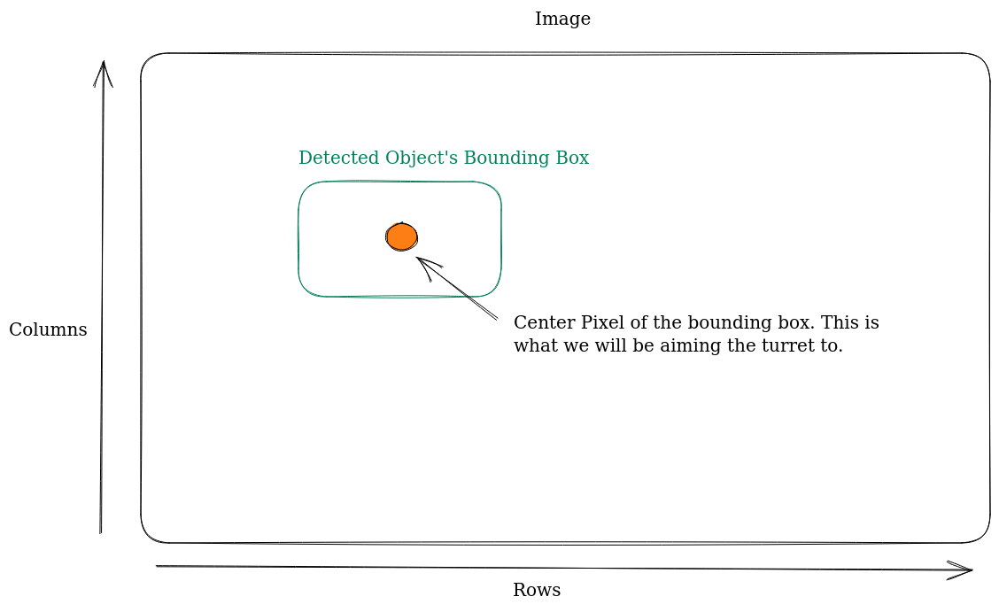
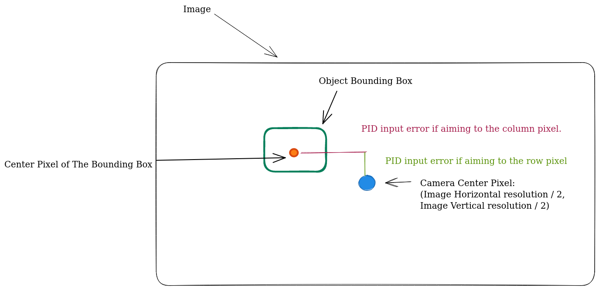

# Turrets
:::note Prerequisites
* [Localization](../odo/What%20is%20Localization.md)
* [Computer Vision](../category/computer-vision)
:::

In recent times, the integration of turrets in robot designs has become increasingly prevalent among the world's top-performing robots. A turret is a mechanism that enables independent rotation of one or more modules from the main body of the robot. This feature is valued for the enhanced mobility it offers. By incorporating a turret, teams can avoid the need to turn the entire robot for scoring purposes, resulting in a substantial elevation of their scoring capabilities.

<iframe width="100%" height="422" src="https://www.youtube.com/embed/GXJ5LX4zIpI" title="FIRST Tech Challenge Automatic FTC Ball Turret" frameborder="0" allow="accelerometer; autoplay; clipboard-write; encrypted-media; gyroscope; picture-in-picture; web-share" allowfullscreen></iframe>

Nevertheless, constructing and programming a turret can pose certain challenges due to the limited availability of documentation on the subject. In this section, we will explore different approaches for programming a turret.
Our discussion will assume that the turret is operated by a single motor linked to an encoder, but the techniques can be adapted to suit alternative control methods as well.

## Automatic Aiming
Typically, the objective is to have the turret mechanism automatically track and aim at a specific target. Manual control of a turret can be more time-consuming compared to manually turning the entire robot. To achieve automatic aiming, two approaches are commonly employed, both relying on the connection of an encoder to the motor responsible for rotating the turret:
* Through the use of odometry localization and geometry
* Through the use of computer vision

### Via Geometry
Prior code needed:
* An accurate odometry localization system (x, y, angle)

In this approach, we leverage geometry alongside odometry data, which continuously provides the robot's current position. By utilizing mathematical principles, we can determine the angle at which the turret needs to rotate. It is important to note that the robot's starting point, serving as the origin, must remain constant for accurate turret aiming using geometry.
By obtaining the coordinates of the target object relative to the origin, we enable the application of mathematical formulas for precise turret tracking.
In summary, we now have three pieces of information:
* The robot's current position relative to the origin
* The object's position relative to the origin
* The robot's angle

:::caution
* All units must be the same, for example, all distances between objects must be in inches. And all angle measurements must be in degrees.
* Note that your angles should be in the range of [0, 360] rather than [-180, 180], which is different from the angle you use for robot movement which requires your angle to be within [-180, 180].
:::


For now, let's continue under the assumption that the robot's angle doesn't change but its (x,y) position does. $\theta$ is the angle from the robot to the object, and thus it is also the angle the turrent must turn to. Lucky for us, there is already an established formula for finding the angle between two points as $\theta$ is known as the bearing angle. 

We can find the bearing angle like this: Define the bearing angle $theta$ from a point $A(a_1,a_2)$ to a point $B(b_1,b_2)$ as the angle measured in the clockwise direction from the north line as the origin to the line segment $AB$



Then, $(b_1,b_2)=(a_1+rsinθ,a_2+rcosθ)$, where $r$ is the length of the line segment $AB$. It follows that $\theta$ satisfies the equation: $tanθ=(b_1−a_2)/(b_1−a_2)$

We can use the `atan2`  function to compute $\theta$.

Note that the equations are given in terms of Cartesian coordinates, so it is necessary to transform them to screen coordinates. The formula for $\theta$ in terms of screen coordinates $(a_1, a_2)$  and $(b_1, b_2)$ is $θ=atan_2(b_1−a_1,a_2−b_2)$.

Formally, it would look like this:
$$
\theta = atan_2(y_2-y_1/x_2-x_1)
$$

In Java we would implement it like this: 
```java 
double theta = toDegrees(Math.atan2(y2 - y1, x2 - x1)); 
```

### Sample Calculation
Using the formula we can solve for the desired turrent angle seen in the image above:
First, let's define the coordinates:
* Origin Point:  $O(0,0)$
* Robot Position:  $A(a_1,a_2)=A(x_1,y_1)=A(0,0)$ 
* Object Position:  $B(b_1,b_2)=B(x_2,y_2)=B(2,2)$

From here we apply the formula derived above: $θ=atan_2(y_2−y_1/x_2−x_1)$

Now just substitute the values:
$$
θ=atan_2(2/2)
$$

### Accounting for Robot Rotation
As mentioned above an additional step is needed correctly calculate the turn angle if the robot has rotated. You can see why we need an extra step through the following diagram:



As you can see, even though the turret motor hasn't changed the turret angle directly, the robot's change in angle has indirectly changed the turret angle.

Therefore, when calculating how much the turret must turn to reach the correct angle you must add the robot angle, to the turret's current angle. 

By subtracting this value from the θ value calculated above, we can find the number of degrees the turrent must turn to reach the target angle. 

All in all, it would look like this in code: 

```java
double destinationAngle = Math.atan2(objectYPosition - robotYPosition, 
objectXPosition - robotXPosition); 

double toTurn = destinationAngle - (turretAngle + robotAngle);
```

### Getting Angle Values
Now there is only one piece of the puzzle missing, finding the angle of the turrent and the angle of the robot.
Finding the angle of the robot is trivial through the IMU (refer to the IMU section if you don't know how to do this).
Finding the angle of the turret is also fairly simple. All you have to do is multiply the encoder tick values of the turrent in order to scale encoder ticks into degrees. Unfortunately, the only way that this scaling factor can be found is by manual tuning. 
:::info
An easy way to do this is to ask your turret to turn 90 degrees. Feed different encoder tick values until you get something close to a 90-degree rotation. After that, your scaling constant should be 90/tickValue.
:::
All in all, your code should look something like this: 
```java
public double scalingFactor = 0.05;
 
public double encoderTicksToAngle(int ticks){
    return (ticks*scalingFactor); 
}

public int angleToEncoderTicks(double degrees){
    return (int)(degrees/scalingFactor); 
}

public double turnTurretBy(double degrees){
    double currentPosition = turretMotor.getCurrentPosition();
    double TARGET_TICK_VALUE = angleToEncoderTicks(degrees) + currentPosition;    
      
    turretMotor.setTargetPosition(TARGET_TICK_VALUE);    
    turretMotor.setMode(DcMotor.RunMode.RUN_TO_POSITION); 
    turretMotor.setPower(1);         
}


// you would call aimtoobject when you want the turret to move. 
public void aimToObject(){
    double robotYPosition = odometry.getY(), robotXPosition = odometry.getX(); 
    double destinationAngle = Math.atan2(objectYPosition - robotYPosition, 
    objectXPosition - robotXPosition); 
    
    turretAngle = encoderTicksToAngle(turretMotor.getEncoderReading());
    robotAngle = getIMU(angle);  
    
    double toTurn = destinationAngle - (turretAngle + robotAngle);
    turnTurretBy(toTurn%360); // take the mod/remainder of toTurn/360
    // to keep the angle in the range of [0,360] 
}
```

## Via Computer Vision
This algorithm assumes that you have a camera attached to the center of your turret mechanism such that your camera rotates with the turret.
Prior Code Needed:
* Camera class
* An accurate TensorFlow model that detects the object you want the turrent to track.

Creating a turret alignment algorithm using computer vision is much easier to implement and understand. However, if your algorithm to detect the image target is inaccurate, then this method will fail. 

Let's start off by taking a look at the concept [TensorFlow object detection file in the FTC samples](https://github.com/FIRST-Tech-Challenge/FtcRobotController/blob/master/FtcRobotController/src/main/java/org/firstinspires/ftc/robotcontroller/external/samples/ConceptTensorFlowObjectDetection.java
): 


```java 
double col = (recognition.getLeft() + recognition.getRight()) / 2 ;
double row = (recognition.getTop()  + recognition.getBottom()) / 2 ;
```

You will see that when your camera picks up a detection, one of the values it will return is the bounds of the bounding box which contains the object. We can calculate the center column and pow pixel of the bounding box through the code above.  



The objective of this algorithm is to center the camera towards either the center row or the column pixel, depending on how your turret moves. If it moves horizontally then we will be aligning with the row pixel, otherwise, we will be aligning with the column pixel. 
:::info
If you are still confused about which pixel your turret should aim toward, take another look at the video above. If your turret rotates in the same fashion as the turret in the video, then your camera will be attempting to align with the center row pixel of the detected object. Otherwise, you will be aiming at the center column pixel. 
:::
To align the camera accurately, we will be creating a PID loop, with the difference between the center pixel of the camera and the center pixel of the object's bounding box as the error input for the PID loop.


All in all, your aiming function would look something like this: 
:::info
Note that some variable declarations have been omitted for brevity. 
:::
```java 
public void aimTurret(int pixelTarget, int cameraCenterPixel, boolean objectDetected){
  if(!objectDetected){
    // if the object is not detected then try making a full revolution in some direction. 
    //turretMotor.setPower(-0.2); 
    /*
     * If your turret motor has a limit on how much it can spin, 
     * set some kind of encoder limit on the motor such that it will
     * spin in the opposite direction when it hits the limit
     */

    if(turretMotor.getCurrentPosition()<=lowerEncoderLimit){
      turretMotor.setPower(0.2); 
    }else if(turretMotor.getCurrentPosition()>=upperEncoderLimit){
      turretMotor.setPower(-0.2); 
    }
  }else{
  // only includes proportional term for brevity, try including the other ones!
    double error = pixelTarget - cameraCenterPixel;
    double p = 0.05; 
    double output = output*p; 
    turretMotor.setPower(output); 
  }
}
```
## Case Study
[Take a look at FTC team Tech Turtles and their turret which makes use of computer vision to aim at various objects](https://github.com/Tech-Turtles/Power-Play/blob/dev/TeamCode/src/main/java/org/firstinspires/ftc/teamcode/Vision/CombinedTracker.java)
