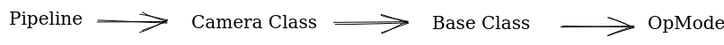

# Intro to OpenCV

:::note Resources
* [EasyOpenCV Library Page](https://github.com/OpenFTC/EasyOpenCV) - Go through the Readme file for installation instructions. Must read!
* [FTC Team KookyBots OpenCV Tutorial](https://www.youtube.com/watch?v=XSv3M58NbRA) - Must watch!
* [EasyOpenCV Examples](https://github.com/OpenFTC/EasyOpenCV/tree/master/examples) - Contains several example image pipleines that you can draw inspiration from. Implements concepts such as object detection via contours and color thresholding.  
:::

OpenCV is currently the most widely used computer vision library in FTC. We will be making use of the Java version of the library via OpenFTC's EasyOpenCV library. 

As opposed to Vuforia, openCV contains many useful functions that make image processing and object detection a simple task. Moreover, it allows for the implementation of advanced computer vision concepts as well, such as object detection. The documentation for OpenCV is far superior to that of Vuforia's making it the best CV tool for most teams. 

Here are some important definitions you should understand: 

* **Camera Class**: Intializes and configures camera hardware and stores information sent from pipeline classes.
* **Pipeline Class**:  Processes the most recent frame returned from the camera and outputs information regarding the image. For example, a pipeline can tell you if a game object is present, the position/orientation of the visual target, and much more.
* **Mat**: A mat is short for matrix, and it is how OpenCV represents an image. It is a grid with dimensions identical to the resolution that you have set your camera to read. Each cell of the matrix represents a pixel in the image and contains the color values of each pixel. 

An OpenCV workflow would look like the following: 

* Before running the pipeline a camera class must be created and linked to the base class. 
* The opMode accesses the camera class from the base class and tells the camera to start processing the images it is being read. 
* The camera class passes the image to the pipeline class and converts the image into a matrix. 
* The active vision pipeline uses the color values from the matrix and returns some information about the image (ie the orientation of a vision target). 
* The opMode receives the information from the pipeline, so it can then be used to tell the robot what to do (ie park in some specific area). 



## Implementation

You can implement an easy-to-use camera class like this: 

:::info
* Notice that you can switch between pipelines using the `setPipeline()` method. You can switch pipelines in your opModes by creating a switch pipeline function shown in the following implementation.
* **You cannot access the pipeline class directly from an OpMode!** To transmit information from the pipeline class to the opMode, you must first transmit the information to the camera module class, which then transmits the data to the opMode. Our implementation makes this process much more clear.  
* We did not include a base class in the following implementation for the sake of brevity. The only difference is instead of declaring the camera class in the opMode, it would be declared as a global variable in the base class and initialized in a `getHardware()` function.
:::

### Pipeline Class
```java 
public class samplePipeline1 extends OpenCvPipeline {
   
  private String output = "nothing";

  public samplePipeline1() {
    
  }
  
  // Mat is the image matrix that should be processed. 
  @Override
  public Mat processFrame(Mat input) {
    output = "Sample Pipeline Is Running!"; 
    return input;
  }

  public String getOutput() {
    return output;
  }
}
```

### Camera Class 
```java 
public class Camera {
  private OpenCvWebcam webcam;
  private HardwareMap hardwareMap;
  private samplePipeline1 p1; // sample pipeline
  private samplePipeline2 p2; // another sample pipeline

  public Camera(HardwareMap hw) { // hardware map from the base class is a parameter
    p1 = new samplePipeline1(); // initialize your pipeline classes
    p2 = new samplePipeline2();

    this.hardwareMap = hw;    //Configure the Camera in hardwaremap
    int cameraMonitorViewId =
        hardwareMap
            .appContext
            .getResources()
            .getIdentifier("cameraMonitorViewId", "id", hardwareMap.appContext.getPackageName());
    // Get camera from hardware map, replace 'camera' with what is in your controlhub
    webcam =
        OpenCvCameraFactory.getInstance()
            .createWebcam(hardwareMap.get(WebcamName.class, "camera"), cameraMonitorViewId);
    
    webcam.setPipeline(p1); // Setting the intial pipeline
    
    webcam.setMillisecondsPermissionTimeout(2500);
    
    // Streaming Frames
    webcam.openCameraDeviceAsync(
        new OpenCvCamera.AsyncCameraOpenListener() {
          @Override
          public void onOpened() {
            webcam.startStreaming(320, 240, OpenCvCameraRotation.UPRIGHT);
          }

          @Override
          public void onError(int errorCode) {}
        });
  }
  
  // Switching Between Pipelines
  public void switchToSecondPipeline(){
      webcam.setPipeline(p2);
  }
  
  public void switchToFirstPipeline(){
      webcam.setPipeline(p1);
  }
  
  // Get information from pipeline 
  public String getPipeline1Output(){ 
      return p1.getOutput(); 
  }
  
  // call stop at the end of the opMode. 
  public void stop() {
    webcam.stopStreaming();
  }
}
```

### OpMode
```java 
@TeleOp(name = "Sample_TeleOP", group = "robot")
public class Test_teleop extends LinearOpMode {
  Camera camera = new Camera(hardwareMap);

  @Override
  public void runOpMode() throws InterruptedException {
    camera.switchToFirstPipeline();
    telemetry.addLine("Status: Initialized");
    waitForStart();

    while (opModeIsActive()) {
      // OpMode receives the information transmitted from the pipeline class
      // to the camera module class. 
      telemetry.addLine(camera.getPipeline1Output()); 
      telemetry.update();
    }
  }
}
```