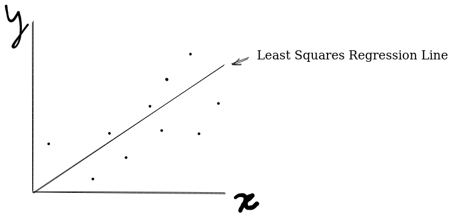
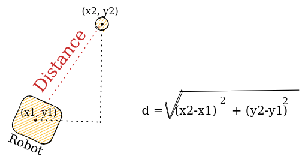

# Linear Regression

Oftentimes when looking to detect an object, a linear regression model is used to estimate the position of the object away from the robot. 

## Least Squares Regression Line

Linear Regression uses the Least Squares Regression line to estimate the pixel offsets of an object and attribute it to how far the robot is from the object. This is found by collecting multiple points and creating a regression line for the data.



A LSRL gives a predicted y value based on the input x value.
$$
y = a + \Beta(x)
$$

This is the formula for a Linear Regression line, where y hat is the predicted value, x is the input, a is the y intercept, and beta is the slope.

## Correlation Coefficient
The correlation coefficient, denoted r, shows the degree of correlation between the points on the plot, a higher correlation coefficient means the Linear Regression Line is more accurate.

$$
r = \frac{n\sum{xy} - (\sum{x})(\sum{y})}{\sqrt{[n\sum{x^2} - (\sum{x})^2][n\sum{y^2} - (\sum{y})^2]}}
$$

## Slope 

The slope is the b or beta value in the linear regression equation, it can be calculated once the correlation coefficient, r, has been found.
$$
\Beta = r * \frac{s_y}{s_x}
$$

The x mean and the y mean are always on the Linear Regression Line, therefore we can derive:
$$
y = a+\Beta x
$$

Since we have the slope, simply plugging in the y bar and the x bar will give you your y-intercept, or a value. This will give you the final Least Squares Regression Line Equation.

## Online LSRL Calculators
If you do not want to do all the math in your code, there are online calculators that you can use do form your linear regression line for you. 

You would first measure an object at multiple different points, measuring the input and the output that you are looking for. Such as distance in inches, and pixel displacement. Then you would put all of those values into a online calculator which would generate the LSRL for you.

https://www.graphpad.com/quickcalcs/linear1/

## Use Case: Setting Shooter Powers Via Linear Regression: 

When attempting to shoot an object at a certain distance away from a target, knowing what power to set can often be a mystery without performing intensive calculations. However, by making use of linear regression, we can easily calculate the correct power that one must apply to the flywheel motor to hit the target. 



:::info
Note that in order to attain a distance reading, you must have an accurate localization system that returns the robot's current position. You must also know the position of the target from the robot's origin point. From there, calculate the x and y displacement of the robot and simply apply the Pythagorean Theorem or Distance Formula to find the distance.
:::

```java 
double distance = getDistance(); //replace getDistancce() with the robot's distance to a target
double yInt = 0.5; //a value in LSRL equation
double slope = 2; //b value in LSRL equation

double bx = slope * distance;
double power = bx + yInt;

shooter.setPower(power);
```

Here, you would put the shooter at different distances and determine the power needed to get the object in the goal, then plug that data into a linear regression calculator to get `yInt` and `slope`.