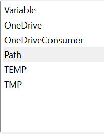

# Wireless Download

:::note Resources
* [Video Tutorial](https://www.youtube.com/watch?v=bCNUGSwhHZk) - The IP adress used in the video may not match modern control hubs, make sure to change it to the right one.
:::


### Android Debug Bridge
We will be using something called Android Debug Bridge(ADB) to download the code wirelessly to the robot. First, you should add the adb executable in your files to your path variables so it can be accessed from everywhere.

### ADB File Path
Here is the default adb file path on windows computers
```bash 
C:\Users\"User Name"\AppData\Local\Android\SDK\platform-tools
```

If we don't add the adb path to path variables, we won't be able to access it from our Android Studio IDE Environment
### Adding to Path
To go to your environment variables, first open the control panel on your computer, then go to these sections.
```bash 
System and Security>>System>>Advanced System Settings>>Environment Variables
```



The user variables should have a left side that looks something like this with different variable types. Double click the path variable. Then, hit browse, and then to go the previously mentioned file path for adb. After you have gone to the file path, hit OK and then you will have that file path saved

Now, you can use the adb executable anywhere since it is one of your computer's path variables!


### Control Hub Connection

First, you have to connect to the wifi network of your control hub, by clicking on wifi networks and finding your control hub's network. Make sure that your robot is on and the control hub has a green light before doing this.

### Usage in Android Studio

Now, in Android Studio, go to the terminal tab, which is found at the bottom bar of the screen.
Use this line to ensure nothing else is connected via adb
```bash 
adb disconnect
```

Use this to connect to the control hub
```bash 
adb connect 192.168.43.1:5555
```

The numbers after the connect are the ip address of the Control Hub. If you are using a robot phone instead, you must find the ip address of the phone by looking at the Program and Manage section of the phone.

Now that you are wirelessly connected, all you need to do to download your code is hit the green play button at the top of the android studio IDE.
