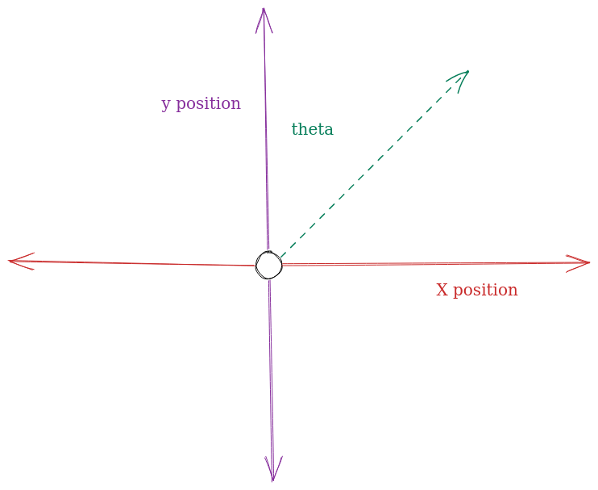

# What is Localization?
:::note Resources
* [RoadRunner Docs FAQ Section](https://learnroadrunner.com/#frequently-asked-questions)
* [RoadRunner Docs Vocab Section](https://learnroadrunner.com/before-you-start.html#terms-to-know)
:::
* 
Localization plays a crucial role in FTC robotics. It refers to the ability of a robot to determine its own position and orientation within its environment. This information is essential for accurate navigation, precise manipulation of objects, and effective strategy execution during FTC competitions. 

Let's break this definition down:

In FTC robotics the robot knows where it is on the game field using three "axes" of measurement:
* Its $x$ position on the field (how far it has moved from its origin point on the field horizontally)
* Its $y$ position on the field (how far it has moved from its origin point vertically)
* Its $\theta$ (theta), also known as its current angle. 

These three values are often referred to as the robot's **pose** on the field. 

You can visualize this by imagining the field as a graph:  

## Applications of Localization

* Autonomous Navigation: Localization enables a robot to navigate autonomously on the competition field. By accurately determining its position, the robot can plan and execute precise movements, such as moving to specific locations, avoiding obstacles, and following designated paths. Localization techniques like odometry, encoders, and inertial measurement units (IMUs) are commonly used for this purpose.
* Object Detection and Manipulation: Localization helps robots identify and interact with game-specific objects during FTC challenges. By knowing its own position, a robot can localize and identify game elements accurately, such as retrieving game pieces, placing them in designated areas, or manipulating them in a specific manner.
* Field Awareness: Localization allows a robot to be aware of its position relative to the competition field boundaries, alliance partners, and opponents. This information is crucial for effective game strategy and collaboration with alliance partners during matches. Robots can use localization to avoid penalties, strategically position themselves, and coordinate actions with other robots.
* Targeting and Scoring: In some FTC games, scoring involves accurately positioning the robot or game elements in specific areas or targets. Localization helps robots precisely target and score points by determining the correct position and orientation required for successful scoring actions.

## Localization Options

To achieve accurate localization in FTC robotics, various technologies and sensor systems are commonly employed, including encoders, vision systems, IMUs, and range sensors. Teams often combine multiple sensors and utilize advanced algorithms like odometry, sensor fusion, and SLAM (Simultaneous Localization and Mapping) to enhance localization accuracy and reliability.

Here is a quick overview of the methods this guide will cover: 

### Drive Encoder Odometry

Assuming that your drive train motors are connected to encoders, you can make use of the encoder readings to estimate the robot's current position. This method allows you to save encoder spots, allowing you to use encoders for other modules in your robot, at the cost of reduced accuracy.

### Deadwheel Odometry

> **RoadRunner Docs:**
> Dead wheels (sometimes referred to as odometry wheels or odometry pods) are unpowered omni wheels not connected to any motor. These wheels have rotary encoders to track distance traveled. This data is fed through a kinematic equation and integrated to calculate the relative position of the robot on the field.

Due to various reasons discussed in the module, deadwheel odometry is by far the most accurate method of calculating your robot's current position. Because of this, the majority of FTC teams make use of deadwheel odometry. However, this odometry variation can take up to three more encoder slots (assuming your drive encoders are also connected to encoders) meaning you will only have one encoder remaining for the remainder of your robot. 

### VSLAM 
VSLAM is typically known as visual odometry and makes use of an image to determine the robot's current position on the field. This method is rarely used in competition due to its inaccuracy, as such, we don't recommend the usage of such a system unless there exists a reason why you cannot use the other two localization methods (ie rugged terrain). 

