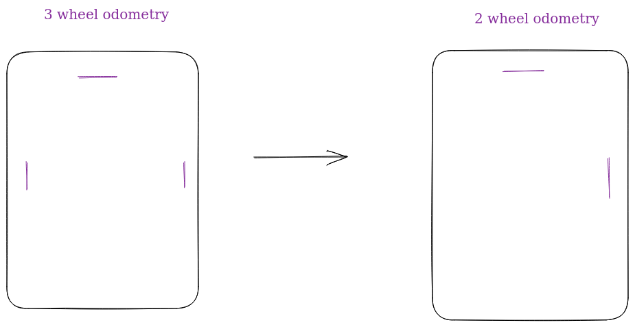

# Deadwheel Odometry (Mecanum and Tank)

:::note Resources
* [GM0's Odometry Page](https://gm0.org/en/latest/docs/software/concepts/odometry.html) - **Must Read!** (Explains deadwheel configurations and provides easy to implement pseudocode + a overview behind the for 3 wheel odometry)
* [RoadRunner's Odometry Paper](https://github.com/acmerobotics/road-runner/blob/master/doc/pdf/Mobile_Robot_Kinematics_for_FTC.pdf)
:::

Deadwheel odometry makes use of unpowered wheels connected to encoders to track the robot's current position. Essentially, a deadwheel odometry algorithm converts the returned encoder measurements into useful values.

For maximized accuracy, most teams make use of three deadwheel setups. However if a team needs an extra encoder slot, some will make do with a two-deadwheel setup and the IMU for angle calculation.

Why use 3-wheel odometry as opposed to 2-wheel: [Answered in RoadRunner docs](https://learnroadrunner.com/#what-is-the-difference-between-two-and-three-wheel-odometry)

## 2 Deadwheel Odometry

Intuitively speaking, we know that a mecanum drive train can move both forward and sideways. Therefore when making use of a two-wheel odometry setup we can see that you only need to use one of the parallel wheels.
:::caution
Note that because we are removing one of the parallel wheels, you cannot calculate the robot's current angle through odometry alone. Instead, you must make use of the IMU.
:::



```java 
public class Odometry {
  // Constants
  public final double ENCODER_WHEEL_DIAMETER = 1.37795; // diameter of the deadwheel
  private final double ENCODER_TICKS_PER_REVOLUTION = 8154; // ticks measured after
  // one full revolution of the deadwheel
  private final double ENCODER_WHEEL_CIRCUMFERENCE = Math.PI * 2.0 * (ENCODER_WHEEL_DIAMETER * 0.5);

  // Variables
  private double xPos, yPos;
  public double angle;
  private double lastLeftEnc = 0, lastNormalEnc = 0;

  public Odometry(double xPos, double yPos) {
    this.xPos = xPos;
    this.yPos = yPos;
  }

  // Two Deadwheel Odo
  /*
  l = ticks from the parallel odometry wheel
  r = ticks from the perpendicular odometry wheel
  ang = robot's angle (in degrees)
  */
  public void updatePosition(double l, double n, double ang) {
    double dL = l - lastLeftEnc;
    double dN = n - lastNormalEnc;
    lastNormalEnc = n;
    lastLeftEnc = l;
    
    double leftDist = -dL * ENCODER_WHEEL_CIRCUMFERENCE / ENCODER_TICKS_PER_REVOLUTION;
    double dyR = leftDist;
    double dxR = -dN * ENCODER_WHEEL_CIRCUMFERENCE / ENCODER_TICKS_PER_REVOLUTION;
    
    double cos = Math.cos((Angle.degrees_to_radians(ang)));
    double sin = Math.sin((Angle.degrees_to_radians(ang)));
    double dx = (dxR * sin) + (dyR * cos);
    double dy = (-dxR * cos) + (dyR * sin);
    
    angle = ang;
    xPos += dx;
    yPos += dy;
  }
  
  public double getX() {
    return xPos;
  }

  public double getY() {
    return yPos;
  }
}
```


## 3 Deadwheel Odometry
Due to the extensive explanations written in the links provided at the top of the module, we feel that it would be redundant to provide our own. Instead, we will just give you an implementation.

[The following code is from the samples of Beta8397's virtual robot simulator:
](https://github.com/Beta8397/virtual_robot/blob/master/TeamCode/src/org/firstinspires/ftc/teamcode/EncBot.java)
```java 
/**
 * Utility class that represents a robot with mecanum drive wheels and three "dead-wheel" encoders.
 */
public class EncBot {
    public final double ENCODER_WHEEL_DIAMETER = 2; // diameter of the deadwheel
    private final double ENCODER_TICKS_PER_REVOLUTION = 1120; // ticks measured after
  // one full revolution of the deadwheel
    private final double ENCODER_WIDTH = 12.0; // distance between parallel deadwheels
    private final double ENCODER_WHEEL_CIRCUMFERENCE = Math.PI * 2.0;
    
    public final DcMotorEx[] motors = new DcMotorEx[4]; //back_left, front_left, front_right, back_right
    public final DcMotorEx[] encoders = new DcMotorEx[3]; //right, left, X
    public int[] prevTicks = new int[3];
    public double[] pose = new double[3];

    public void init(HardwareMap hwMap){
        String[] motorNames =  new String[]{"back_left_motor", "front_left_motor", "front_right_motor", "back_right_motor"};
        for (int i=0; i<4; i++) motors[i] = hwMap.get(DcMotorEx.class, motorNames[i]);
        motors[0].setDirection(DcMotorSimple.Direction.REVERSE);
        motors[1].setDirection(DcMotorSimple.Direction.REVERSE);
        // store deadwheels in an array. 
        String[] encoderNames = new String[]{"enc_right", "enc_left", "enc_x"};
        for (int i=0; i<3; i++) encoders[i] = hwMap.get(DcMotorEx.class, encoderNames[i]);
    }

    public void setDrivePower(double px, double py, double pa){
        double[] p = new double[4];
        p[0] = -px + py - pa;
        p[1] = px + py - pa;
        p[2] = -px + py + pa;
        p[3] = px + py + pa;
        double max = Math.max(1, Math.max(Math.abs(p[0]), Math.max(Math.abs(p[1]), Math.max(Math.abs(p[2]), Math.abs(p[3])))));
        if (max > 1) for (int i=0; i<4; i++) p[i] /= max;
        for (int i=0; i<4; i++) motors[i].setPower(p[i]);
    }

    public void resetOdometry(double x, double y, double headingRadians){
        pose[0] = x;
        pose[1] = y;
        pose[2] = headingRadians;
        for (int i=0; i<3; i++) prevTicks[i] = encoders[i].getCurrentPosition();
    }

    // call updateOdometry everytime you set powers to your drive motors. 
    public double[] updateOdometry(){
        int[] ticks = new int[3];
        for (int i=0; i<3; i++) ticks[i] = encoders[i].getCurrentPosition();
        int newRightTicks = ticks[0] - prevTicks[0];
        int newLeftTicks = ticks[1] - prevTicks[1];
        int newXTicks = ticks[2] - prevTicks[2];
        prevTicks = ticks;
        
        double rightDist = newRightTicks * ENCODER_WHEEL_CIRCUMFERENCE / ENCODER_TICKS_PER_REVOLUTION;
        double leftDist = -newLeftTicks * ENCODER_WHEEL_CIRCUMFERENCE / ENCODER_TICKS_PER_REVOLUTION;
        double dyR = 0.5 * (rightDist + leftDist);
        double headingChangeRadians = (rightDist - leftDist) / ENCODER_WIDTH;
        double dxR = -newXTicks * ENCODER_WHEEL_CIRCUMFERENCE / ENCODER_TICKS_PER_REVOLUTION;
        double avgHeadingRadians = pose[2] + headingChangeRadians / 2.0;
        
        double cos = Math.cos(avgHeadingRadians);
        double sin = Math.sin(avgHeadingRadians);
        pose[0] += dxR*sin + dyR*cos;
        pose[1] += -dxR*cos + dyR*sin;
        pose[2] = AngleUtils.normalizeRadians(pose[2] + headingChangeRadians);
        
        return pose;
    }

    public double[] getPose(){
        return pose;
    }

}
```

