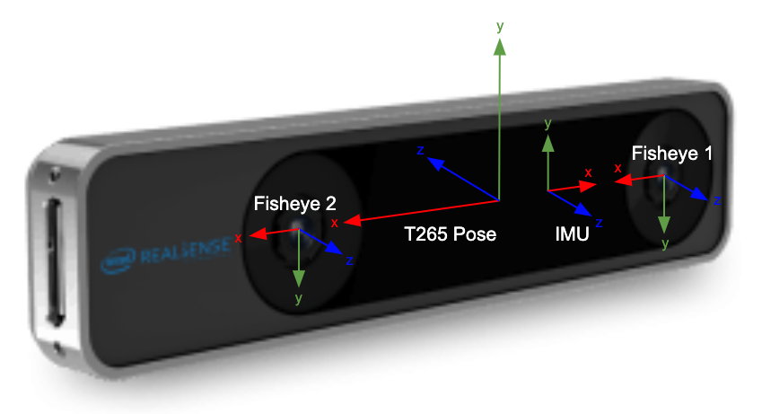

# VSLAM 

In FTC, VSLAM is a way of localization that makes use of a specific camera. In FTC, the specific camera used is called the [Intel T265 Camera](https://www.intelrealsense.com/tracking-camera-t265/). It uses its fisheye lenses in accordance with its variety of sensors to return a pose regarding the robot's location.

There has been an api created for the T265 camera, this github page gives all the information necessary from gradle implementation to how to use it to return the robot's position in the code.

https://github.com/pietroglyph/ftc265

> **Intel**: 
> "An ideal operating environment for the T265 has a reasonable number of fixed, distinct visual features in view. It will perform poorly if the entire field of view contains moving, near field objects such as people"

:::danger
The T265 camera and the use of it for VSLAM has now been banned from FTC effective from the 2023-24 CENTERSTAGE Season. We are leaving this page up to help out teams who are looking to experiment with it as a project for learning, but DO NOT COMPETE with this camera as it will not be allowed at inspection.
:::
